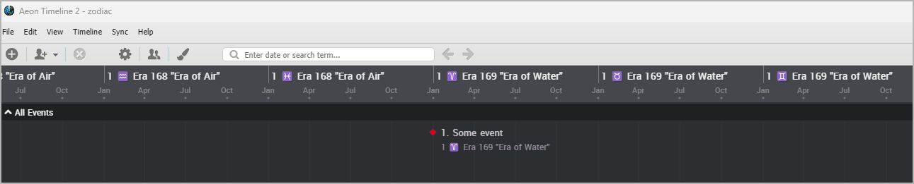
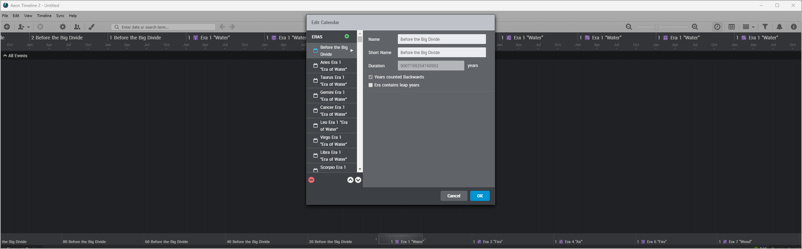

[Project homepage](index) > zodiac

------------------------------------------------------------------

# zodiac.py

Create a "Zodiac" calendar for Aeon templates.

- The "Zodiac" calendar system has eras each of 12 years. 
- The complete cycle is 48 years, because it is also linked to the elements "Water", "Fire", "Wood", and "Air".
- Each year is represented by a Zodiac sign.

The Python script redefines Aeon Timeline eras as years in order to give them names.
The names include the Zodiac sign, the numbered era, and the element.

The script inserts 1000 "Zodiac years" into an Aeon Timeline template file. 

## Requirements

- [Python 3.9+](https://www.python.org). 

### Download:

- [zodiac.py for Aeon Timeline 2 templates (Download link)](https://raw.githubusercontent.com/peter88213/paeon/main/src/zodiac.py)
- [zodiac3.py for Aeon Timeline 3 templates (Download link)](https://raw.githubusercontent.com/peter88213/paeon/main/src/zodiac.py)

### Instructions for use:

### Intended usage

Download the Python script and create a shortcut on the desktop. 
- If you drag a template file onto it and drop it, a modified template file
named *zodiac.xml* resp. *zodiac.json* is created. 

### Command line usage

Alternatively, you can

- launch the program on the command line passing the template file as an argument, or
- launch the program via a batch file.

#### Aeon Timeline 2 template

usage: `zodiac.py path-to-template`

positional arguments:
  `path-to-template`  The path of the .xml template file.

#### Aeon Timeline 3 template

usage: `zodiac3.py path-to-template`

positional arguments:
  `path-to-template`  The path of the .json template file.

## License

zodiac.py and zodiac3.py are distributed under the [MIT License](http://www.opensource.org/licenses/mit-license.php).
